# AloeStackView

A simple class for laying out a collection of views with a convenient API, while leveraging the power of Auto Layout.

[](https://github.com/Carthage/Carthage)
[](https://cocoapods.org/pods/AloeStackView)
[](https://cocoapods.org/pods/AloeStackView)
[](https://cocoapods.org/pods/AloeStackView)
[](https://travis-ci.com/airbnb/AloeStackView)

## Introduction

`AloeStackView` is a class that allows a collection of views to be laid out in a vertical list. In a broad sense, it is similar
to `UITableView`, however its implementation is quite different and it makes a different set of trade-offs.

We first started using `AloeStackView` at Airbnb in our iOS app in 2016. We have since used it to implement nearly
200 screens in the app. The use cases are quite varied: everything from settings screens, to forms for creating a new
listing, to the listing share sheet.

|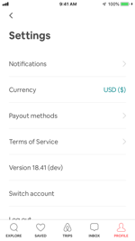|||||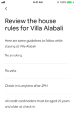|
| --- | --- | --- | --- | --- | --- |
|||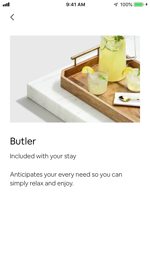|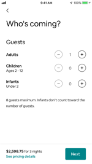||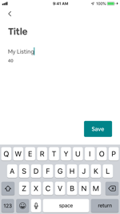| 

`AloeStackView` focuses first and foremost on making UI very quick, simple, and straightforward to implement. It
does this in two ways:

* It leverages the power of Auto Layout to automatically update the UI when making changes to views.

* It forgoes some features of `UITableView`, such as view recycling, in order to achieve a much simpler and safer API.

We've found `AloeStackView` to be a useful piece of infrastructure and hope you find it useful too!

## Table of Contents

* [Features](#features)
* [System Requirements](#system-requirements)
* [Example App](#example-app)
* [Usage](#usage)
  - [Creating an AloeStackView](#creating-an-aloestackview)
  - [Adding, Removing, and Managing Rows](#adding-removing-and-managing-rows)
  - [Handling User Interaction](#handling-user-interaction)
  - [Dynamically Changing Row Content](#dynamically-changing-row-content)
  - [Styling and Controlling Separators](#styling-and-controlling-separators)
  - [Extending AloeStackView](#extending-aloestackview)
  - [When to use AloeStackView](#when-to-use-aloestackview)
* [Installation](#installation)
* [Contributions](#contributions)
* [Maintainers](#maintainers)
* [Contributors](#contributors)
* [License](#license)
* [Why is it called AloeStackView?](#why-is-it-called-aloestackview)

## Features

* Allows you to keep strong references to views and dynamically change their properties, while Auto Layout
automatically keeps the UI up-to-date.

* Allows views to be dynamically added, removed, hidden and shown, with optional animation.

* Includes built-in support for customizable separators between views.

* Provides an extensible API, allowing specialized features to be added without modifying `AloeStackView` itself.

* Widely used and vetted in a highly-trafficked iOS app.

* Small, easy-to-understand codebase (under 500 lines of code) with no external dependencies keeps binary size
increase to a minimum and makes code contributions and debugging painless.

## System Requirements

* Deployment target iOS 9.0+
* Xcode 10.0+
* Swift 4.0+

## Example App

The repository includes a simple [example iOS app](Example).

You can try it out by cloning the repo, opening `AloeStackViewExample.xcworkspace`, and running the app.

The example app shows a few ways `AloeStackView` can be used to implement a screen in an iOS app.

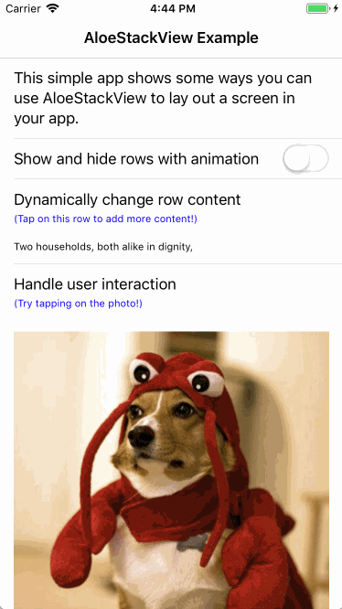

## Usage

### Creating an AloeStackView

The primary API is accessed via the `AloeStackView` class.

You can create an instance of `AloeStackView` quite easily in your code:

```swift
import AloeStackView

let stackView = AloeStackView()
```

`AloeStackView` is a `UIView` (specifically a `UIScrollView`), and thus can be used in the same way as any other
view in your app.

Alternatively, if you want to build an entire `UIViewController` using `AloeStackView`, you can use the convenient
`AloeStackViewController` class:

```swift
import AloeStackView

public class MyViewController: AloeStackViewController {

  public override func viewDidLoad() {
    super.viewDidLoad()
    stackView.addRow(...)
  }

}
```

`AloeStackViewController` is very similar to classes such as `UITableViewController` and
`UICollectionViewController` in that it creates and manages an `AloeStackView` for you. You can access the
`AloeStackView` via the `stackView` property. Using `AloeStackViewController` rather than creating your own
`AloeStackView` inside a `UIViewController` simply saves you some typing.

### Adding, Removing, and Managing Rows

The API of `AloeStackView` generally deals with "rows". A row can be any `UIView` that you want to use in your UI.

Rows are arranged in a vertical column, and each row stretches the full width of the `AloeStackView`.

To build a UI with `AloeStackView`, you generally begin by adding the rows that make up your UI:

```swift
for i in 1...3 {
  let label = UILabel()
  label.text = "Label \(i)"
  stackView.addRow(label)
}
```
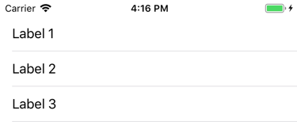

If the length of an `AloeStackView` ever grows too long for the available screen space, the content automatically
becomes scrollable.

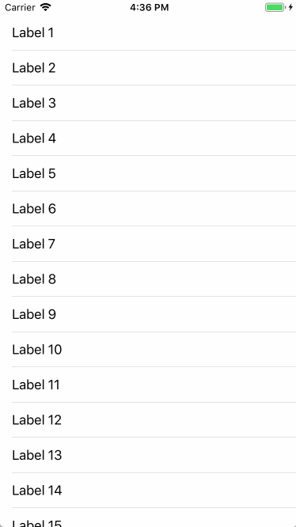

`AloeStackView` provides a comprehensive set of methods for managing rows, including inserting rows at the
beginning and end, inserting rows above or below other rows, hiding and showing rows, removing rows, and retrieving
rows.

You can customize the spacing around a row with the `rowInset` property, and the `setInset(forRow:)` and
`setInset(forRows:)` methods.

The class documentation in [AloeStackView.swift](Sources/AloeStackView/AloeStackView.swift) provides full details of
all the APIs available.

### Handling User Interaction

`AloeStackView` provides support for handling tap gestures on a row:

```swift
stackView.setTapHandler(
  forRow: label,
  handler: { [weak self] label in
    self?.showAlert(title: "Row Tapped", message: "Tapped on: \(label.text ?? "")")
  })

label.isUserInteractionEnabled = true
```
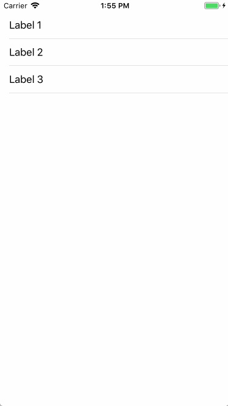

A tap handler will only fire if `isUserInteractionEnabled` is `true` for a row.

Another way of handling tap gestures is to conform to the `Tappable` protocol:

```swift
public class ToggleLabel: UILabel, Tappable {

  public func didTapView() {
    textColor = textColor == .red ? .black : .red
  }

}

for i in 1...3 {
  let label = ToggleLabel()
  label.text = "Label \(i)"
  label.isUserInteractionEnabled = true
  stackView.addRow(label)
}
```
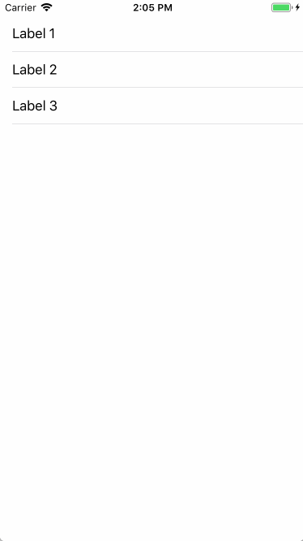

Conforming to `Tappable` allows common tap gesture handling behavior to be encapsulated inside a view. This way
you can reuse a view in an `AloeStackView` many times, without writing the same tap gesture handling code each
time.

### Dynamically Changing Row Content

One of the advantages of using `AloeStackView` is that you can keep a strong reference to a view even after you've
added it to an `AloeStackView`.

If you change a property of a view that affects the layout of the overall UI, `AloeStackView` will automatically relayout
all of its rows:

```swift
stackView.setTapHandler(forRow: label, handler: { label in
  label.text = (label.text ?? "") + "\n\nSome more text!"
})
```


As you can see, there's no need to notify `AloeStackView` before or after making changes to a view. Auto Layout will
ensure that the UI remains in an up-to-date state.

### Styling and Controlling Separators

`AloeStackView` adds separators between rows by default:


#### Turning Separators On and Off

You can easily hide separators for any rows that are added to an `AloeStackView`:

```swift
stackView.hidesSeparatorsByDefault = true
```
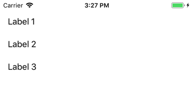

The `hidesSeparatorsByDefault` property only applies to new rows that are added. Rows already in the
`AloeStackView` won't be affected.

You can hide or show separators for existing rows with the `hideSeparator(forRow:)`,
`hideSeparators(forRows:)`, `showSeparator(forRow:)`, and `showSeparators(forRows:)` methods.

`AloeStackView` also provides a convenient property to automatically hide the last separator:

```swift
stackView.automaticallyHidesLastSeparator = true
```
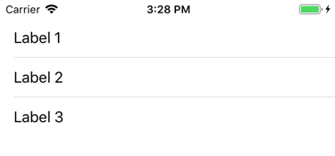

#### Customizing Separators

You can change the spacing on the left and right of separators:

```swift
stackView.separatorInset = .zero
```


As with `hidesSeparatorsByDefault`, this property only applies to new rows that are added. Rows already in the
`AloeStackView` won't be affected.

You can change the separator inset for existing rows with the `setSeperatorInset(forRow:)` and
`setSeperatorInset(forRows:)` methods.

`AloeStackView` also provides properties for customizing the color and height of separators:

```swift
stackView.separatorColor = .blue
stackView.separatorHeight = 2
```
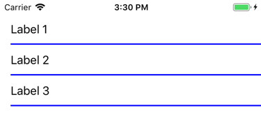

These properties affect all of the separators in the `AloeStackView`.

### Extending AloeStackView

`AloeStackView` is an open class, so it's easy to subclass to add custom functionality without changing the original
source code. Additionally, `AloeStackView` provides two methods that can be used to further extend its capabilities.

#### configureCell(_:)

Every row in an `AloeStackView` is wrapped in a `UIView` subclass called `StackViewCell`. This view is used for
per-row bookkeeping and also manages UI such as separators and insets.

Whenever a row is added or inserted into an `AloeStackView`, the `configureCell(_:)` method is called. This
method is passed the newly created `StackViewCell` for the row.

You can override this method to perform any customization of cells as needed, for example to support custom
features you've added to `AloeStackView` or control the appearance of rows on the screen.

This method is always called after any default values for the cell have been set, so any changes you make in this
method won't be overwritten by the system.

#### cellForRow(_:)

Whenever a row is inserted into an `AloeStackView`, the `cellForRow(_:)` method is called to obtain a new cell for
the row. By default, `cellForRow(_:)` simply returns a new `StackViewCell` that contains the row passed in.

`StackViewCell`, however, is an open class that can be subclassed to add custom behavior and functionality as
needed. To have `AloeStackView` use your custom cell, override `cellForRow(_:)` and return an instance of your
custom subclass.

Providing a custom `StackViewCell` subclass allows much more find-grained control over how rows are displayed. It
also allows custom data to be stored along with each row, which can be useful to support any functionality you add to
`AloeStackView`.

One thing to remember is that `AloeStackView` will apply default values to a cell after it is returned from
`cellForRow(_:)`. Hence, if you need to apply any further customizations to your cell, you should consider doing it in
`configureCell(_:)`.

#### When to Extend AloeStackView

These methods together provide quite a lot of flexibility for extending `AloeStackView` to add custom behavior and
functionality.

For example, you can add new methods to `AloeStackView` to control the way rows are managed, or to support new
types of user interaction. You can customize properties on `StackViewCell` to control the individual appearance of
each row. You can subclass `StackViewCell` to store new data and properties with each row in order to support
custom features you add. Subclassing `StackViewCell` also provides more fine-grained control over how rows are
displayed.

However, this flexibility inevitably comes with a trade-off in terms of complexity and maintenance. `AloeStackView`
has a comprehensive API that can support a wide variety of use cases out-of-the-box. Hence, it's often better to see if
the behavior you need is available through an existing API before resorting to extending the class to add new features.
This can often save time and effort, both in terms of the cost of developing custom functionality as well as ongoing
maintenance.

### When to use AloeStackView

#### The Short Answer

`AloeStackView` is best used for shorter screens with less than a screenful or two of content. It is particularly suited to
screens that accept user input, implement forms, or are comprised of a heterogeneous set of views.

However, it's also helpful to dig a bit deeper into the technical details of `AloeStackView`, as this can help develop a
better understanding of appropriate use cases.

#### More Details

`AloeStackView` is a very useful tool to have in the toolbox. Its straightforward, flexible API allows you to build UI
quickly and easily.

Unlike `UITableView` and `UICollectionView`, you can keep strong references to views in an `AloeStackView` and
make changes to them at any point. This will automatically update the entire UI thanks to Auto Layout - there is no
need to notify `AloeStackView` of the changes.

This makes `AloeStackView` great for use cases such as forms and screens that take user input. In these situations,
it's often convenient to keep a strong reference to the fields a user is editing, and directly update the UI with validation
feedback.

`AloeStackView` has no `reloadData` method, or any way to notify it about changes to your views. This makes it less
error-prone and easier to debug than a class like `UITableView`. For example, `AloeStackView` won't crash if not
notified of changes to the underlying data of the views it manages.

Since `AloeStackView` uses `UIStackView` under the hood, it doesn't recycle views as you scroll. This eliminates
common bugs caused by not recycling views correctly. You also don't need to independently maintain the state of
views as the user interacts with them, which makes it simpler to implement certain kinds of UI.

However, `AloeStackView` is not suitable in all situations. `AloeStackView` lays out the entire UI in a single pass
when your screen loads. As such, longer screens will start seeing a noticeable delay before the UI is displayed for the
first time. This is not a great experience for users and can make an app feel unresponsive to navigation actions.
Hence, `AloeStackView` should not be used when implementing UI with more than a screenful or two of content.

Forgoing view recycling is also a trade-off: while `AloeStackView`  is faster to write UI with and less error-prone, it will
perform worse and use more memory for longer screens than a class like `UITableView`. Hence, `AloeStackView` is
generally not appropriate for screens that contain many views of the same type, all showing similar data. Classes like
`UITableView` or `UICollectionView` often perform better in those situations.

While `AloeStackView` is not the only piece of infrastructure we use to build iOS UI at Airbnb, it has been valuable for
us in many situations. We hope you find it useful too!

## Installation

`AloeStackView` can be installed with [Carthage](https://github.com/Carthage/Carthage). Simply add
`github "airbnb/AloeStackView"` to your Cartfile.

`AloeStackView` can be installed with [CocoaPods](http://cocoapods.org). Simply add
`pod 'AloeStackView'` to your Podfile.

## Contributions

`AloeStackView` is feature complete for the use cases it was originally designed to address. However, UI
development on iOS is never a solved problem, and we expect new use cases to arise and old bugs to be uncovered.

As such we fully welcome contributions, including new features, feature requests, bug reports, and fixes. If you'd like
to contribute, simply push a PR with a description of your changes. You can also file a GitHub Issue for any bug
reports or feature requests.

Please feel free to email the project maintainers if you'd like to get in touch. We'd love to hear from you if you or your
company has found this library useful!

## Maintainers

`AloeStackView` is developed and maintained by:

Marli Oshlack (marli@oshlack.com)

Fan Cox (fan.cox@airbnb.com)

Arthur Pang (arthur.pang@airbnb.com)

## Contributors

`AloeStackView` has benefited from the contributions of many other Airbnb engineers:

Daniel Crampton, Francisco Diaz, David He, Jeff Hodnett, Eric Horacek, Garrett Larson, Jasmine Lee, Isaac Lim,
Jacky Lu, Noah Martin, Phil Nachum, Gonzalo Nuñez, Laura Skelton, Cal Stephens, and Ortal Yahdav

In addition, open sourcing this project wouldn't have been possible without the help and support of Jordan Harband,
Tyler Hedrick, Michael Bachand, Laura Skelton, Dan Federman, and John Pottebaum.

## License

`AloeStackView` is released under the Apache License 2.0. See LICENSE for details.

## Why is it called AloeStackView?

We like succulents and find the name soothing 😉
